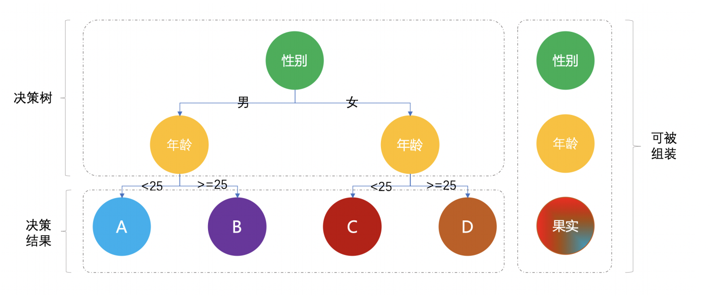

# Java设计模式

[TOC]

设计模式遵循六⼤原则：

1. 单⼀职责( ⼀个类和⽅法只做⼀件事 )
2. ⾥⽒替换( 多态，⼦类可扩展⽗类 )
3. 依赖倒置( 细节依赖抽象，下层依赖上层 )
4. 接⼝隔离( 建⽴单⼀接⼝ )
5. 迪⽶特原则( 最少知道，降低耦合 )
6. 开闭原则( 抽象架构，扩展实现 )


------


## 创建者模式

**这类模式提供创建对象的机制，能够提升已有代码的灵活性和可复用性**

创建者模式包括：⼯⼚⽅法、抽象⼯⼚、⽣成器、原型、单例，这5类。


### 工厂方法模式

⼯⼚模式⼜称⼯⼚⽅法模式，是⼀种创建型设计模式，其在⽗类中提供⼀个创建对象的⽅法， 允许⼦类决定实例化对象的类型。它的主要意图是定义⼀个创建对象的接⼝，让其⼦类⾃⼰决定实例化哪⼀个⼯⼚类，⼯⼚模式使其创建过程延迟到⼦类进⾏。

简单说就是为了提供代码结构的扩展性，屏蔽每⼀个功能类中的具体实现逻辑。让外部可以更加简单的只是知道调⽤即可。

业务场景：

多种类型商品不同接口，统一发奖服务搭建场景

### 抽象工厂模式

抽象⼯⼚模式与⼯⼚⽅法模式虽然主要意图都是为了解决，**接⼝选择**问题。但在实现上，抽象⼯⼚是⼀个中⼼⼯⼚，创建其他⼯⼚的模式。

抽象⼯⼚模式，所要解决的问题就是在⼀个产品族，存在多个不同类型的产品(Redis集群、操作系统)情况下，接⼝选择的问题。

业务场景：

替换Redis双集群升级，代理类抽象场景

### 建造者模式

**建造者模式所完成的内容就是通过将多个简单对象通过⼀步步的组装构建出⼀个复杂对象的过程。**

例如你玩王者荣耀的时的初始化界⾯；有三条路、有树⽊、有ᰀ怪、有守卫塔等等，甚⾄依赖于你的⽹络情况会控制清晰度。⽽当你换⼀个场景进⾏其他不同模式的选择时，同样会建设道路、树⽊、野怪等等，但是他们的摆放和⼤⼩都有不同。这⾥就可以⽤到建造者模式来初始化游戏元素。

⽽这样的根据相同的 物料 ，不同的组装所产⽣出的具体的内容，就是建造者模式的最终意图，也就是；

**将⼀个复杂的构建与其表示相分离，使得同样的构建过程可以创建不同的表示。**

业务场景：

各项装修物料组合套餐选配场景

### 原型模式

原型模式主要解决的问题就是创建重复对象，⽽这部分 对象 内容本身⽐较复杂，⽣成过程可能从库或者RPC接⼝中获取数据的耗时较⻓，因此采⽤克隆的⽅式节省时间。

在原型模式中所需要的⾮常重要的⼿段就是克隆，在需要⽤到克隆的类中都需要实现 implements Cloneable 接⼝。

业务场景：

上机考试多套试卷，每⼈题⽬和答案乱序排列场景

### 单例模式

单例模式可以说是整个设计中最简单的模式之⼀，⽽且这种⽅式即使在没有看设计模式相关资料也会常⽤在编码开发中。因为在编程开发中经常会遇到这样⼀种场景，那就是需要保证⼀个类只有⼀个实例哪怕多线程同时访问，并需要提供⼀个全局访问此实例的点。

综上以及我们平常的开发中，可以总结⼀条经验，单例模式主要解决的是，⼀个全局使⽤的类频繁的创建和消费，从⽽提升提升整体的代码的性能。

业务场景：

1. 数据库的连接池不会反复创建

2. spring中⼀个单例模式bean的⽣成和使⽤

3. 在我们平常的代码中需要设置全局的的⼀些属性保存

单例模式的实现⽅式⽐较多，主要在实现上是否⽀持懒汉模式、是否线程安全中运⽤各项技巧。当然也有⼀些场景不需要考虑懒加载也就是懒汉模式的情况，会直接使⽤ static 静态类或属性和⽅法的⽅式进⾏处理，供外部调⽤。

- #### 静态类使用

  ```java
  public class Singleton_00 {
  
      public static Map<String,String> cache = new ConcurrentHashMap<String, String>();
  
  }
  ```

  - 以上这种⽅式在我们平常的业务开发中⾮常常⻅，这样静态类的⽅式可以在第⼀次运⾏的时候直接初始化Map类，同时这⾥我们也不需要到延迟加载在使⽤。
  - 在不需要维持任何状态下，仅仅⽤于全局访问，这个使⽤静态类的⽅式更加⽅便。
  - 但如果需要被继承以及需要维持⼀些特定状态的情况下，就适合使⽤单例模式。

- #### 懒汉模式(线程不安全)

  ```java
  public class Singleton_01 {
  
      private static Singleton_01 instance;
  
      private Singleton_01() {
      }
  
      public static Singleton_01 getInstance(){
          if (null != instance) return instance;
          return new Singleton_01();
      }
  
  }
  ```

  - 单例模式有⼀个特点就是不允许外部直接创建，也就是 new Singleton_01() ，因此这⾥在默认的构造函数上添加了私有属性 private 。
  - ⽬前此种⽅式的单例确实满⾜了懒加载，但是如果有多个访问者同时去获取对象实例你可以想象成⼀堆⼈在抢厕所，就会造成多个同样的实例并存，从⽽没有达到单例的要求。

- #### 懒汉模式(线程安全)

  ```java
  public class Singleton_02 {
  
      private static Singleton_02 instance;
  
      private Singleton_02() {
      }
  
      public static synchronized Singleton_02 getInstance(){
          if (null != instance) return instance;
          instance = new Singleton_02();
          return instance;
      }
  
  }
  ```

  - 此种模式虽然是安全的，但由于把锁加到⽅法上后，所有的访问都因需要锁占⽤导致资源的浪费。
  - 如果不是特殊情况下，不建议此种⽅式实现单例模式。

- #### 饿汉模式(线程安全)

  ```java
  public class Singleton_03 {
  
      private static Singleton_03 instance = new Singleton_03();
  
      private Singleton_03() {
      }
  
      public static Singleton_03 getInstance() {
          return instance;
      }
  
  }
  ```

  - 此种⽅式与我们开头的第⼀个实例化 Map 基本⼀致，在程序启动的时候直接运⾏加载，后续有外部需要使⽤的时候获取即可。
  - 但此种⽅式并不是懒加载，也就是说⽆论你程序中是否⽤到这样的类都会在程序启动之初进⾏创建。
  - 那么这种⽅式导致的问题就像你下载个游戏软件，可能你游戏地图还没有打开呢，但是程序已经将这些地图全部实例化。到你⼿机上最明显体验就⼀开游戏内存满了，⼿机卡了，需要换了。

- #### 使用类的内部类(线程安全)

  ```java
  public class Singleton_04 {
  
      private static class SingletonHolder {
          private static Singleton_04 instance = new Singleton_04();
      }
  
      private Singleton_04() {
      }
  
      public static Singleton_04 getInstance() {
          return SingletonHolder.instance;
      }
  
  }
  ```

  - 使⽤类的静态内部类实现的单例模式，既保证了线程安全有保证了懒加载，同时不会因为加锁的⽅式耗费性能。
  - 这主要是因为JVM虚拟机可以保证多线程并发访问的正确性，也就是⼀个类的构造⽅法在多线程环境下可以被正确的加载。
  - 此种⽅式也是⾮常推荐使⽤的⼀种单例模式

- #### 双重锁校验(线程安全)

  ```java
  public class Singleton_05 {
  
      private static volatile Singleton_05 instance;
  
      private Singleton_05() {
      }
  
      public static Singleton_05 getInstance(){
         if(null != instance) return instance;
         synchronized (Singleton_05.class){
             if (null == instance){
                 instance = new Singleton_05();
             }
         }
         return instance;
      }
  
  }
  ```

  - 双重锁的⽅式是⽅法级锁的优化，减少了部分获取实例的耗时。
  - 同时这种⽅式也满⾜了懒加载。

- ####  **CAS**「**AtomicReference**」(**线程安全**)

  ```java
  public class Singleton_06 {
  
      private static final AtomicReference<Singleton_06> INSTANCE = new AtomicReference<Singleton_06>();
  
      private static Singleton_06 instance;
  
      private Singleton_06() {
      }
  
      public static final Singleton_06 getInstance() {
          for (; ; ) {
              Singleton_06 instance = INSTANCE.get();
              if (null != instance) return instance;
              INSTANCE.compareAndSet(null, new Singleton_06());
              return INSTANCE.get();
          }
      }
  
      public static void main(String[] args) {
          System.out.println(Singleton_06.getInstance()); // org.itstack.demo.design.Singleton_06@2b193f2d
          System.out.println(Singleton_06.getInstance()); // org.itstack.demo.design.Singleton_06@2b193f2d
      }
  }
  ```

  - ava并发库提供了很多原⼦类来⽀持并发访问的数据安全性；
  -  AtomicInteger 、 AtomicBoolean 、 AtomicLong 、 AtomicReference 。
  - AtomicReference 可以封装引⽤⼀个V实例，⽀持并发访问如上的单例⽅式就是使⽤了这样的⼀个特点。
  - 使⽤CAS的好处就是不需要使⽤传统的加锁⽅式保证线程安全，⽽是依赖于CAS的忙等算法，依赖于底层硬件的实现，来保证线程安全。相对于其他锁的实现没有线程的切换和阻塞也就没有了额外的开销，并且可以⽀持较⼤的并发性。
  - 当然CAS也有⼀个缺点就是忙等，如果⼀直没有获取到将会处于死循环中。

- #### **Effffective Java**作者推荐的枚举单例**(**线程安全)

  ```java
  public enum Singleton_07 {
  
      INSTANCE;
      public void test(){
          System.out.println("hi~");
      }
  
  }
  ```

  - Effffective Java 作者推荐使⽤枚举的⽅式解决单例模式，此种⽅式可能是平时最少⽤到的。
  - 这种⽅式解决了最主要的；线程安全、⾃由串⾏化、单⼀实例。

  **调用方式**

  ```java
  
      public void test() {
          Singleton_07.INSTANCE.test();
      }
  
  ```

  - 这种写法在功能上与共有域⽅法相近，但是它更简洁，⽆偿地提供了串⾏化机制，绝对防⽌对此实例化，即使是在⾯对复杂的串⾏化或者反射攻击的时候。虽然这种⽅法还没有⼴泛采⽤，但是单元素的枚举类型已经成为实现*Singleton*的最佳⽅法。
  - 但也要知道此种⽅式在存在继承场景下是不可⽤的。


------


## 结构型模式

**这类模式介绍如何将对象和类组装成较⼤的结构， 并同时保持结构的灵活和⾼效。**

结构型模式包括：适配器、桥接、组合、装饰器、外观、享元、代理，这7类。


### 适配器模式

适配器模式的主要作⽤就是把原本不兼容的接⼝，通过适配修改做到统⼀。使得⽤户⽅便使⽤，就像我们提到的万能充、数据线、MAC笔记本的转换头、出国旅游买个插座等等，他们都是为了适配各种不同的插⼝ ，做的兼容。

在业务开发中我们会经常的需要做不同接⼝的兼容，尤其是中台服务，中台需要把各个业务线的各种类型服务做统⼀包装，再对外提供接⼝进⾏使⽤。⽽这在我们平常的开发中也是⾮常常⻅的。

业务场景：

从多个MQ消息体中，抽取指定字段值场景

### 桥接模式

桥接模式的主要作⽤就是通过将抽象部分与实现部分分离，把多种可匹配的使⽤进⾏组合。说⽩了核⼼实现也就是在A类中含有B类接⼝，通过构造函数传递B类的实现，这个B类就是设计的 桥 。

JDBC多种驱动程序的实现、同品牌类型的台式机和笔记本平板、业务实现中的多类接⼝同组过滤服务等。这些场景都⽐较适合使⽤桥接模式进⾏实现，因为在⼀些组合中如果有如果每⼀个类都实现不同的服务可能会出现笛卡尔积，⽽使⽤桥接模式就可以⾮常简单。

桥接模式的关键是选择的桥接点拆分，是否可以找到这样类似的相互组合，如果没有就没必要⾮得使⽤桥接模式

业务场景：

多⽀付渠道(微信、⽀付宝)与多⽀付模式(刷脸、指纹)场景

### 组合模式

通过把相似对象(也可以称作是⽅法)组合成⼀组可被调⽤的结构树对象的设计思路叫做组合模式。

将对象组合成树形结构以表示"部分-整体"的层次结构。组合模式使得⽤户对单个对象和组合对象的使⽤具有⼀致性。



业务场景：

营销差异化⼈群发券，决策树引擎搭建场景

### 装饰器模式

装饰器的核⼼就是在不改原有类的基础上给类新增功能。**不改变原有类**，可能有的⼩伙伴会想到继承、AOP切⾯，当然这些⽅式都可以实现，但是使⽤装饰器模式会是另外⼀种思路更为灵活，可以避免继承导致的⼦类过多，也可以避免AOP带来的复杂性。

在装饰器模式中有四个⽐较重要抽象出来的点；

1. 抽象构件⻆⾊(Component) - 定义抽象接⼝

2. 具体构件⻆⾊(ConcreteComponent) - 实现抽象接⼝，可以是⼀组

3. 装饰⻆⾊(Decorator) - 定义抽象类并继承接⼝中的⽅法，保证⼀致性

4. 具体装饰⻆⾊(ConcreteDecorator) - 扩展装饰具体的实现逻辑

**装饰器实现的重点是对抽象类继承接⼝⽅式的使⽤，同时设定被继承的接⼝可以通过构造函数传递其实现类，由此增加扩展性并重写⽅法⾥可以实现此部分⽗类实现的功能**

业务场景：

SSO单点登录功能扩展，增加拦截⽤户访问⽅法范围场景

### 外观模式

外观模式也叫⻔⾯模式，主要解决的是降低调⽤⽅的使⽤接⼝的复杂逻辑组合。这样调⽤⽅与实际的接⼝提供⽅提供⽅提供了⼀个中间层，⽤于包装逻辑提供API接⼝。有些时候外观模式也被⽤在中间件层，对服务中的通⽤性复杂逻辑进⾏中间件层包装，让使⽤⽅可以只关⼼业务开发。

为⼦系统中的⼀组接⼝提供⼀个⼀致的界⾯，外观模式定义了⼀个⾼层接⼝，这个接⼝使得这⼀⼦系统更加容易使⽤。

**那么这样的模式在我们的所⻅产品功能中也经常遇到**，就像⼏年前我们注册⼀个⽹站时候往往要添加很多信息，包括；姓名、昵称、⼿机号、QQ、邮箱、住址、单身等等，但现在注册成为⼀个⽹站的⽤户只需要⼀步即可，⽆论是⼿机号还是微信也都提供了这样的登录服务。⽽对于服务端应⽤开发来说以前是提供了⼀个整套的接⼝，现在注册的时候并没有这些信息，那么服务端就需要进⾏接⼝包装，在前端调⽤注册的时候服务端获取相应的⽤户信息(从各个渠道)，如果获取不到会让⽤户后续进⾏补全(营销补全信息给奖励)，以此来拉动⽤户的注册量和活跃度。也就是将填写用户信息这一部分独立出来。

⼀般情况下对于外观模式的使⽤通常是⽤在复杂或多个接⼝进⾏包装统⼀对外提供服务上，此种使⽤⽅式也相对简单在我们平常的业务开发中也是最常⽤的。你可能经常听到把这两个接⼝包装⼀下，但在本例⼦中我们把这种设计思路放到中间件层，让服务变得可以统⼀控制。

业务场景：

基于SpringBoot开发⻔⾯模式中间件，统⼀控制接⼝⽩名单场景

### 享元模式

享元模式，主要在于共享通⽤对象，减少内存的使⽤，提升系统的访问效率。⽽这部分共享对象通常⽐较耗费内存或者需要查询⼤量接⼝或者使⽤数据库资源，因此统⼀抽离作为共享对象使⽤。

另外享元模式可以分为在服务端和客户端，⼀般互联⽹H5和Web场景下⼤部分数据都需要服务端进⾏处理，⽐如数据库连接池的使⽤、多线程线程池的使⽤，除了这些功能外，还有些需要服务端进⾏包装后的处理下发给客户端，因为服务端需要做享元处理。但在⼀些游戏场景下，很多都是客户端需要进⾏渲染地图效果，⽐如；树⽊、花草、⻥⾍，通过设置不同元素描述使⽤享元公⽤对象，减少内存的占⽤，让客户端的游戏更加流畅。

在享元模型的实现中需要使⽤到享元⼯⼚来进⾏管理这部分独⽴的对象和共享的对象，避免出现线程安全的问题。

享元模式⼀般情况下使⽤此结构在平时的开发中并不太多，除了⼀些线程池、数据库连接池外，再就是游戏场景下的场景渲染。另外这个设计的模式思想是减少内存的使⽤提升效率，与我们之前使⽤的**原型模式**通过克隆对象的⽅式⽣成复杂对象，减少rpc的调⽤，都是此类思想。

业务场景：

基于Redis秒杀，提供活动与库存信息查询场景

### 代理模式

代理模式主要解决的是为某些资源的访问、对象的类的易⽤操作上提供⽅便使⽤的代理服务。⽽这种设计思想的模式经常会出现在我们的系统中，或者你⽤到过的组件中，它们都提供给你⼀种⾮常简单易⽤的⽅式控制原本你需要编写很多代码的进⾏使⽤的服务类。

类似这样的场景；

1. 你的数据库访问层⾯经常会提供⼀个较为基础的应⽤，以此来减少应⽤服务扩容时不⾄于数据库连接数暴增。

2. 使⽤过的⼀些中间件例如；RPC框架，在拿到jar包对接⼝的描述后，中间件会在服务启动的时候⽣成对应的代理类，当调⽤接⼝的时候，实际是通过代理类发出的socket信息进⾏通过。

3. 另外像我们常⽤的 MyBatis ，基本是定义接⼝但是不需要写实现类，就可以对 xml 或者⾃定义注解⾥的 sql 语句进⾏增删改查操作。

代理模式除了开发中间件外还可以是对服务的包装，物联⽹组件等等，让复杂的各项服务变为轻量级调⽤、缓存使⽤。你可以理解为你家⾥的电灯开关，我们不能操作220v电线的⼈⾁连接，但是可以使⽤开关，避免触电。

业务场景：

模拟mybatis-spring中定义DAO接⼝，使⽤代理类⽅式操作数据库原理实现场景


------


## 行为模式

**这类模式负责对象间的⾼效沟通和职责委派。**

⾏为模式包括：责任链、命令、迭代器、中介者、备忘录、观察者、状态、策略、模板、访问者，这10类。


### 责任链模式

避免请求发送者与接收者耦合在⼀起，让多个对象都有可能接收请求，将这些对象连接成⼀条链，并且沿着这条链传递请求，直到有对象处理它为⽌。

责任链模式的核⼼是解决⼀组服务中的先后执⾏处理关系，就有点像你没钱花了，需要家庭财务⽀出审批，10块钱以下找闺⼥审批，100块钱先闺⼥审批在媳妇审批。你可以理解想象成当你要跳槽的时候被安排的明明⽩⽩的被各个领导签字放⾏。

责任链模式可以让各个服务模块更加清晰，⽽每⼀个模块间可以通过 next 的⽅式进⾏获取。⽽每⼀个 next 是由继承的统⼀抽象类实现的。最终所有类的职责可以动态的进⾏编排使⽤，编排的过程可以做成可配置化

业务场景：

模拟618电商⼤促期间，项⽬上线流程多级负责⼈审批场景

### 命令模式

命令模式在我们通常的互联⽹开发中相对来说⽤的⽐较少，但这样的模式在我们的⽇常中却经常使⽤到，那就是 Ctrl+C 、 Ctrl+V 。从这样的模式感受上，可以想到这是把逻辑实现与操作请求进⾏分离，降低耦合⽅便扩展。

命令模式是⾏为模式中的⼀种，以数据驱动的⽅式将 命令对象 ，使⽤构造函数的⽅式传递给调⽤者。调⽤者再提供相应的实现为命令执⾏提供操作⽅法。

在这个设计模式的实现过程中有如下⼏个⽐较重要的点；

1. 抽象命令类；声明执⾏命令的接⼝和⽅法，实现者的行为

2. 具体的命令实现类；接⼝类的具体实现，可以是⼀组相似的⾏为逻辑

3. 实现者；也就是为命令做实现的具体实现类

4. 调⽤者；处理命令、实现的具体操作者，负责对外提供命令服务

业务场景：

模拟⾼档餐厅⼋⼤菜系，服务员点单厨师烹饪场景

### 迭代器模式

迭代器模式，提供⼀种⽅法顺序访问⼀个聚合对象中各个元素, ⽽⼜⽆须暴露该对象的内部表示。常⻅的就是我们⽇常使⽤的 iterator 遍历。

虽然这个设计模式在我们的实际业务开发中的场景并不多，但却⼏乎每天都要使⽤ jdk 为我们提供的 list 集合遍历。另外增强的for循环虽然是循环输出数据，但是他不是迭代器模式。

迭代器模式的特点是实现 Iterable 接⼝，通过 next 的⽅式获取集合元素，同时具备对元素的删除等操作。⽽增强的for循环是不可以的。

这种设计模式的优点是可以让我们以相同的⽅式，遍历不同的数据结构元素，这些数据结构包括； 数组 、 链表、 树 等，⽽⽤户在使⽤遍历的时候并不需要去关⼼每⼀种数据结构的遍历处理逻辑，从让使⽤变得统⼀易⽤。

业务场景：

模拟公司组织架构树结构关系，深度迭代遍历⼈员信息输出场景

### 中介者模式

中介者模式要解决的就是复杂功能应⽤之间的重复调⽤，在这中间添加⼀层中介者包装服务，对外提供简单、通⽤、易扩展的服务能⼒。

⽤⼀个中介对象来封装⼀系列的对象交互，中介者使各对象不需要显式地相互引⽤，从⽽使其耦合松散，⽽且可以独⽴地改变它们之间的交互。

这样的设计模式⼏乎在我们⽇常⽣活和实际业务开发中都会⻅到，例如；⻜机降落有⼩姐姐在塔台喊话、⽆论哪个⽅向来的候⻋都从站台上下、公司的系统中有⼀个中台专⻔为你包装所有接⼝和提供统⼀的服务等等，这些都运⽤了中介者模式。除此之外，你⽤到的⼀些中间件，他们包装了底层多种数据库的差异化，提供⾮常简单的⽅式进⾏使⽤

业务场景：

按照Mybatis原理⼿写ORM框架，给JDBC⽅式操作数据库增加中介者场景

### 备忘录模式

备忘录模式是以可以恢复或者说回滚，配置、版本、悔棋为核⼼功能的设计模式。

在功能实现上是以不破坏原对象为基础增加备忘录操作类，记录原对象的⾏为从⽽实现备忘录模式。

业务场景：

模拟互联⽹系统上线过程中，配置⽂件回滚场景

### 观察者模式

简单来讲观察者模式，就是当⼀个⾏为发⽣时传递信息给另外⼀个⽤户接收做出相应的处理，两者之间没有直接的耦合关联。

定义对象间的⼀种⼀对多的依赖关系，当⼀个对象的状态发⽣改变时，所有依赖于它的对象都得到通知并被⾃动更新。

经过观察者模式改造后，代码将拆分出核心业务流程和辅助业务流程。

除了⽣活中的场景外，在我们编程开发中也会常⽤到⼀些观察者的模式或者组件，例如我们经常使⽤的MQ服务，虽然MQ服务是有⼀个通知中⼼并不是每⼀个类服务进⾏通知，但整体上也可以算作是观察者模式的思路设计。再⽐如可能有做过的⼀些类似事件监听总线，让主线服务与其他辅线业务服务分离，为了使系统降低耦合和增强扩展性，也会使⽤观察者模式进⾏处理。

业务场景：

模拟类似⼩客⻋指标摇号过程，监听消息通知⽤户中签场景

### 状态模式

状态模式描述的是⼀个⾏为下的多种状态变更，⽐如我们最常⻅的⼀个⽹站的⻚⾯，在你登录与不登录下展示的内容是略有差异的( 不登录不能展示个⼈信息 )，⽽这种 登录 与 不登录 就是我们通过改变**状态**，⽽让整个⾏为发⽣了变化。

这⾥的实现有⼀个关键点就是每⼀种状态到下⼀个状态，都分配到各个实现⽅法中控制，也就不需要 if语⾔进⾏判断了

业务场景：

模拟系统营销活动，状态流程审核发布上线场景

### 策略模式

策略模式是⼀种⾏为模式，也是替代⼤量 ifelse 的利器。它所能帮你解决的是场景，⼀般是具有同类可替代的⾏为逻辑算法场景。⽐如；不同类型的交易⽅式(信⽤卡、⽀付宝、微信)、⽣成唯⼀ID策略(UUID、DB⾃增、DB+Redis、雪花算法、Leaf算法)等，都可以使⽤策略模式进⾏⾏为包装，供给外部使⽤。

定义⼀系列的算法,把它们⼀个个封装起来,并且使它们可相互替换。

策略模式也有点像三国演义中诸葛亮给刘关张的锦囊；

大致结构包括一个接口以及接口的n个实现类，并提供了一个上下控制处理，整体的策略服务。

通过使用泛型⽤于不同类型的接⼝可以传递不同的类型参数，相当于三国演义中不同时机打开的锦囊都不同。

业务场景：

模拟多种营销类型优惠券，折扣⾦额计算策略场景

### 模板模式

模板模式的核⼼设计思路是通过在，抽象类中定义抽象⽅法的执⾏顺序，并将抽象⽅法设定为只有⼦类实现，但不设计 独⽴访问 的⽅法。

定义⼀个操作中的算法的⻣架，⽽将⼀些步骤延迟到⼦类中。模板⽅法使得⼦类可以不改变⼀个算法的结构即可重定义该算法的某些特定步骤。

关键代码在抽象类实现，定义可被外部访问的模板⽅法，在该方法中定义抽象方法的执行顺序，提供具体的抽象方法让外部继承方实现，外部继承方只需关心具体的业务逻辑实现即可。

业务逻辑：

模拟爬⾍各类电商商品，⽣成营销推⼴海报场景

### 访问者模式

访问者要解决的核⼼事项是，在⼀个稳定的数据结构下，例如⽤户信息、雇员信息等，增加易变的业务访问逻辑。为了增强扩展性，将这两部分的业务解耦的⼀种设计模式。

访问者模式的核⼼在于同⼀个事物不同视⻆下的访问信息不同。主要将数据结构与数据操作分离。

实现逻辑：

1. 建⽴被访问者抽象类和抽象访问⽅法，再由不同的被访问者实现

2. 建⽴访问者接⼝，⽤于不同访问者的访问操作

3. 最终是对数据的看板建设，⽤于实现不同视⻆的访问结果输出

业务场景：

模拟家⻓与校⻓，对学⽣和⽼师的不同视⻆信息的访问场景

